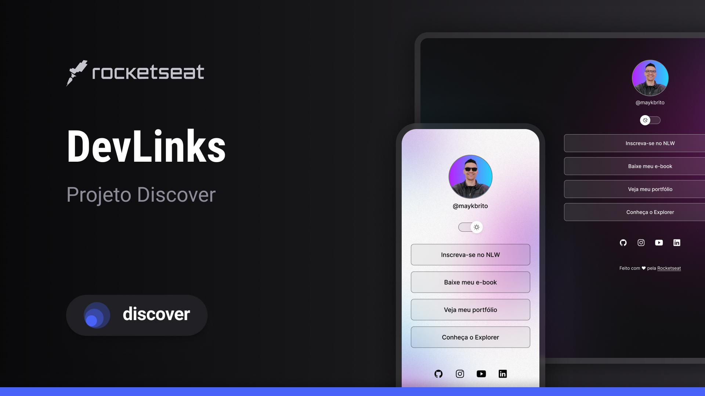

<h1 align="center"> DevLinks – Agregador de Links </h1>

Projeto de um agregador de links responsivo com troca de tema, desenvolvido durante o curso Discover da Rocketseat.

  <a href="#-tecnologias">Tecnologias</a>&nbsp;&nbsp;&nbsp;|&nbsp;&nbsp;&nbsp;
  <a href="#-projeto">Projeto</a>&nbsp;&nbsp;&nbsp;|&nbsp;&nbsp;&nbsp;
  <a href="#-licença">Licença</a>

  

 

  

## 🚀 Tecnologias

Esse projeto foi desenvolvido com as seguintes tecnologias:

- HTML e CSS
- JavaScript
- Git e GitHub
- Figma

## 💻 Projeto

Este projeto foi essencial para aplicar na prática os conhecimentos fundamentais de HTML, CSS e JavaScript. A proposta foi construir um agregador de links que pudesse ser usado como cartão de visitas online, com tema claro/escuro, design responsivo e recursos interativos.

Durante o desenvolvimento, pude:

- Entender melhor a estrutura do HTML e como organizar listas, links, ícones e rodapé;
- Aprender sobre `margin`, `padding` e o uso do `Flexbox` para alinhamento e responsividade;
- Criar botões interativos com pseudo-classes como `:hover`, dando mais vida à interface;
- Estilizar a página com base em variáveis CSS e aplicar o conceito de reset CSS para padronizar estilos;
- Posicionar elementos com `position: absolute` e dominar ajustes finos com DevTools;
- Trabalhar com SVGs para melhorar o visual dos ícones e garantir leveza no carregamento;
- Utilizar `media queries` para adaptar o layout a diferentes dispositivos e tamanhos de tela;
- Aplicar animações simples em CSS para transições suaves entre os temas;

No JavaScript, aprendi:

- Conceitos básicos como variáveis, funções, objetos e lógica condicional;
- Capturar eventos com `addEventListener` e manipular o DOM dinamicamente;
- Criar lógica para alternar entre modo claro e escuro alterando atributos e classes;
- Atualizar atributos HTML diretamente via JavaScript, tornando o layout mais dinâmico;

No Git e GitHub, pude:

- Inicializar o repositório, criar commits organizados e versionar as etapas do projeto;
- Subir o projeto para o GitHub e disponibilizá-lo com GitHub Pages;
- Criar um README detalhado e completo para apresentar o projeto de forma profissional;

Esse projeto me ajudou a entender como pequenos detalhes de código e boas práticas de organização impactam diretamente na usabilidade e na experiência final de quem acessa a página. Foi uma excelente forma de consolidar os aprendizados do Discover com um projeto prático e funcional.

## 📝 Licença
Este projeto está sob a licença MIT.

 Feito com ♥ by Amanda

